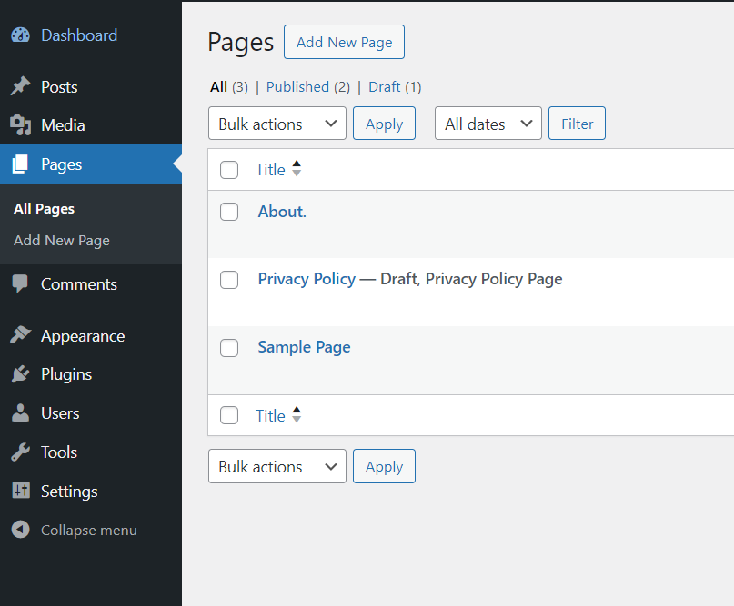

# Le Dashboard

---

Une fois installé, vous verez que nous avons déjà un site que WordPress a automatiquement créé pour nous.

Ce n'est pas le site de l'année, j'en conviens, mais c'est déjà quelque chose ! :)

(tous les ans WordPress a un noveau "site" qui vient déjà avec son installation)

Vous pouvez voir qu'on peut accéder à des pages, a des posts de blog, etc.

- Cherchez dans la page où se trouve la liste d'articles et cliquez sur le premier. (souvent il s'appelle "Hello World")
- Vous pouvez voir qu'il a un titre, une date, un autheur, un contenu, etc.
- Maintenant, allez dans votre dashboard et analysons-le...

Ouff... Beaucoup de choses à première vue !

Concentrons-nous sur les onglets à gauche. Comme vous pouvez voir, nous avons une section `posts`, `page` et `comments`, etc.

Dans ces sections, vous trouverez les entrées qui existent dans chacun. Dans `posts` par exemple, vous trouverez le "Hello World".

Dans "Hello World", voilà qu'on peut changer le texte, ajouter des images, etc, etc. à la façon WYSIWYG (What You See Is What You Get) --> un peu comme dans Word ou Google Docs.

- Modifiez le contenu du post
- Ajoutez des posts avec le contenu que vous voulez
- Vérifiez dans votre frontend les modifications

Les articles (posts) de blog sont listés sur votre site et ont chacun une page qui leur est dédiée. Mais il y a aussi des pages comme on les entend de manière courante.

Pour l'instant, vous n'en avez qu'une appelée "Sample Page". Elle se trouve dans le menu tout en haut et vous pouvez y acceder.

---

Une `page` fonctionne comme un post en fait. Vous l'éditez en WYSIWYG et elle apparaît avec le contenu enregistré. Elle ne sera juste pas disponibilisée dans la liste des posts. Elle aura un URL propre (le texte qui apparait dans votre navigateur en haut).

- Créez une nouvelle page et donnez-lui le contenu que vous souhaitez.
- Vérifiez que la page se trouve maintenant dans le menu tout en haut et accédez-la.

---

Voilà... comme vous voyez, il est très facile d'éditer un site avec WordPress. Créer des pages, publier des articles...

Mais bien-sûr, nous sommes ici limités graphiquement et structurellement au site fourni par WordPress.

C'est là où interviennent les `themes`.

Voyons ça dans le prochain chapitre !
