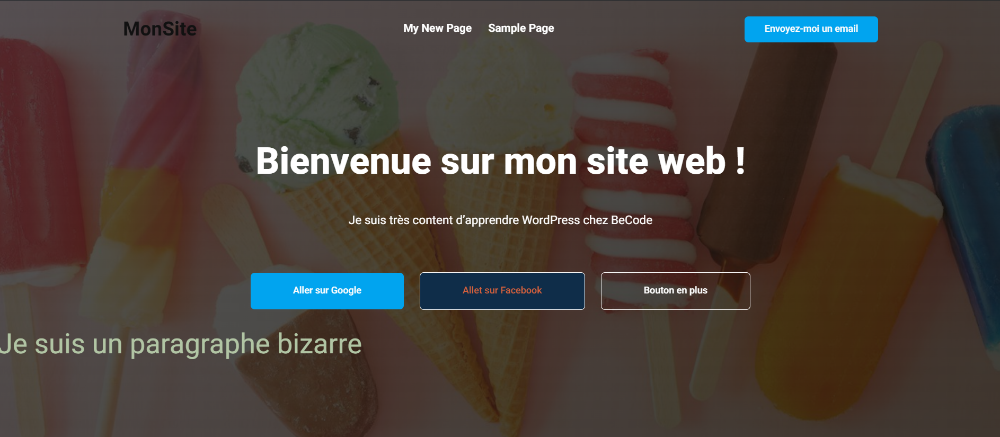

# Themes

---

Comme vous avez pu le remarquer, nous sommes limités pour l'instant à ajouter des articles (ou changer le contenu des pages) au site par défaut de WordPress.

Biensûr, ce n'est pas ce que nous voulons... Nous voulons pouvoir choisir à quoi va ressembler notre site, avec le design et contenu de notre choix !

C'est là qu'on retrouve le concept de `themes` dans WordPress.

---

Un `theme` est basiquement la partie frontend du site (ce que l'on voit). C'est un site déjà tout codé dans lequel nous allons éditer (et eventuellement ajouter) les contenus que l'on souhaite (texte, images, liens, etc.).

Cette partie frontend est liée via le code aux options que nous avons dans le dashboard, ce qui rend la relation dashboard/frontend dynamique. (on peut changer du contenu, qui sera reflété dans le visuel)

---

Un développeur WordPress va coder un site de A à Z et le "dynamiser" en le "pluggand" au dashboard.

Nous, en tant qu'utilisateurs no-code, allons juste choisir un thême et éditer le contenu de celui-ci de manière graphique et intuitive.

---

- Tout d'abord, activez un thême de WordPress d'une autre année (le `Twenty-Twenty-Two` par exemple.)

Vous verrez que c'est un nouveau site, avec un autre design, d'autres couleurs, sections, etc. Mais, les pages et articles que vous aviez créés avant sont toujours là, comme prévu par le code du nouveau thême en question.

Ceci est dû au fait que la base de donnée qui stocke tous les textes et images de votre projet est indépendante du thême. Les articles, pages, photos, etc sont toujours dans la base de donnée. Et si le code du thême prevoit de les utiliser, vous pouvez naviguer entre différents thêmes qui les supportent.

**Exercice**
(Les instructions pour les exercices n'expliquent pas trop comment les faire. C'est le but ! À vous de trouver ! Google, ChatGPT, etc sont vos amis ;) )

- Ajoutez un nouveau thême à votre projet : cherchez le thême `AgencyGrove`.
   
- Quand le thême est installé, allez dans "Customize" pour changer le thême comme vous le voulez.

   

- Trouvez une façon de faire que la page principale ressemble à ça (c'est horrible, je sais! C'est juste pour se casser un peu la tête à changer les éléments et style):

- Adaptez et ajoutez les texte et bouton en fonction de l'image de référence que je vous ai donée.
   
- Changez l'image de fond avec celle présente dans ce dossier.
   
- Changez les couleurs des boutons pour qu'ils soient comme dans l'image de référence.
   
- Faites en sorte que le bouton "Aller sur Google" vous mène bien sur Google. (tips: link avec l'adresse de Google `https://www.google.com`)
  (Faites en sorte que le lien s'ouvre dans une nouvelle fenêtre.)
   
- Faites en sorte que le bouton "Aller sur Facebook" vous mène bien sur Facebook.
   
- Faites en sorte que le boutons "Envoyez-moi un email" ouvre votre programme de mail déjà avec l'adresse que vous aurez mise. (tips: `mailto:henrique.vieira@becode.org`)

---

Oooook... Vous avez dû voir qu'au premier contact avec WordPress, les choses ne sont pas si évidentes que ça à prendre en main.

Il faut vraiment chercher pour juste changer une couleur. Mais on commence à avoir une idée de la puissance (et de la facilité quand même) de WordPress pour créer un site sans devoir passer par du code.

Il faut se souvenir que derrière chaque thême il y a du code réalisé par un développeur qui a prévu les façons de customiser le site en question. D'autres thêmes seront différents.

Cependant, ne vous inquiétez pas ! Nous allons bientôt attaquer un plugin appelé **Elementor** qui rend les choses beaucoup plus intuitives et vous donne un contrôle total de quoi faire avec votre page.

Mais pour cela, comprenons d'abord ce que sont les plugins...
