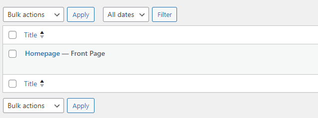

# Elementor

---

Voici une liste guidée avec explications de ce que vous devez faire pour mettre Elementor en marche et créer un super site !

Pour chaque étape, essayez de bien comprendre ce que vous faites. Je vous donne des tips, quelques petites explications...

Mais quand ce n'est pas suffisant, c'est à vous d'aller demander sur Google/ChatGPT/etc. "comment installer un theme?", "comment installer un plugin?", "comment définir la page principale d'un site WordPress?", etc. etc.

Ici, vous aurez une bonne feuille de route pour arriver à la partie fun : celle de construire le site ! ;)

---

1. **Créez un nouveau projet sur `Local`.**

---

2. **Faisons un peu le ménage :**

- Dans la page principale du `Tableau de bord`, faites en sorte qu'il n'y ai plus aucune info dont on n'a pas besoin. Tip : `Options de l'écran`


- Effacez tout ce qui n'est pas nécessaire à votres site : articles, pages, commentaires... Pensez à vider la corbeille également.


---

3. **Installez le thême `Astra`.**

```
Astra est un theme qui offre une grande quantité de templates et customisation. Avec lui seul, on pourrait créer des centaines de sites différents.

Cependant, nous ne l'utiserons pas pour ça.

Nous l'utiliserons parce que son theme de base est très minimaliste et cela nous facilitera la vie pour implementer Elementor, qui nous cadenasse encore moins et nous donne plus de possibilités.
```

---

4. **Effacez tous les autre thêmes pré-installés (`Twenty Twenty Two`, `Twenty Twenty Three`, etc.)**

---

5. **Créez une page et donnez-lui un nom du genre "Homepage"**

```
Ce genre de page est ce qu'on appelle une "page statique".
```

---

6. **Faites en sorte que la page d'accueil de votre site soit celle que vous venez de créer**

```
tip : Réglages > Lecture > La page d'accueil affiche...

Il faut qu'à côté de votre page il soit indiqué que c'est la page d'accueil
```



---

7. **Entrez dans le frontend de votre site**.

```
Vous voyez comment c'est minimaliste ? Juste un simple header, le titre de la page et le footer. C'est à partir de là que nous avancerons.
```

---

8. **Cherchez, Installez et Activez le plugin `Elementor Website Builder`**

```
Petite précision : La version gratuite de Elementor ne permet pas d'éditer le header, ni le footer. C'est pour ça que nous allons aussi installer un autre plugin...
```

---

9. **Cherchez, Installez et Activez le plugin `Elementor Header & Footer Builder`**

```
Ce plugin nous permet de créer un header et un footer utilisant les outils de Elementor et de pouvoir les avoir dans toutes les pages du site.

Il ira "écraser" le header du theme Astra.
```

---

10. **Créez un header et un footer vides avec le plugin `Elementor Header & Footer Builder`**

```
Apparence > Elementor Header & Footer Builder...
Puis "Add new" et selectionnez "header". Répétez avec "footer"
```

Si vous rafraichissez la page maintenant, vous allez voir qu'on a... une page blanche !!!

Super ! On peut commencer maintenant à utiliser les outils d'Elementor pour créer notre header/footer via l'onglet `Elementor Header & Footer Builder` où vous avez créé ces sections vides.

Et utiliser Elementor directement sur les pages.

---

11. **Avant de créer un header, créons un menu!**

```
Créer un menu dans le backend de WordPress est nécessaire, car c'est la backend qui va associer chaque élément du menu aux pages / articles existants.

Tip : Apparence > Menus... Cherchez comment on en crée un.
```

[tutoriel](https://youtu.be/FsLDRn20ONM?si=nX-zR_QHva9fO9Un)

---

12. **Reproduisez ce header et footer**

```
Utilisez l'image "logo.png" dans ce dossier.
```


---

13. **Rendez-vous sur la page Homepage et selectionnez "éditer avec Elementor"**

```
Vous serez mené à une nouvelle fenêtre où tout les "widgets" seront sur la gauche et vous pourrez juste les glisser et déposer sur la page.
```

---

Pour la suite, attaquez-vous au design que vous avez créé il y a quelques jours.

---

### RESSOURCES

[tutoriel de 1h sur Elementor](https://youtu.be/_LixFHi9SKs?si=bNVkrOazdgX48J3i)
