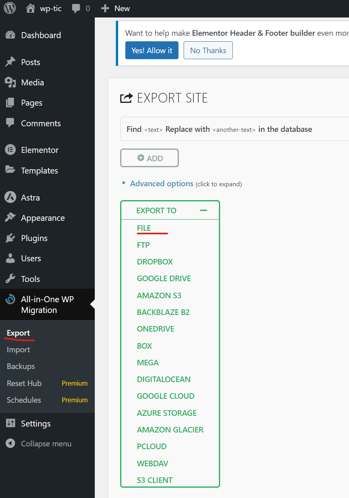
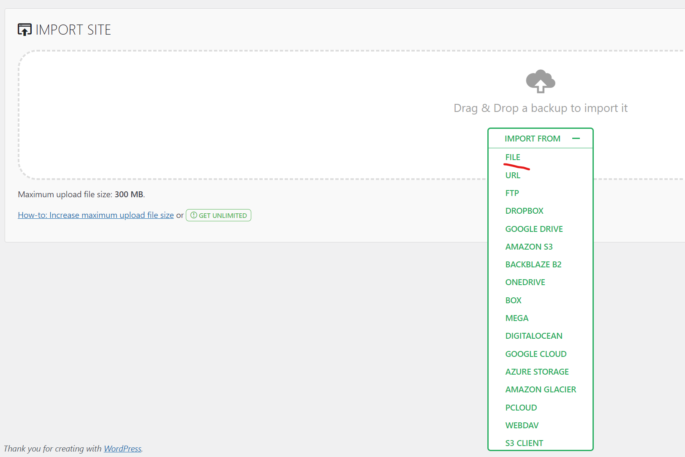

# Mettre en ligne

---

Bon... vous avez terminé votre super site !
Il manque quelque chose... Que les personnes puissent le voir !

Heureusement pour nous, mettre un site WordPress en ligne est la chose la plus facile sur internet !

Vous pourrez trouver une multitude de services qui vous proposent d'héberger un site WordPress pour très peu d'argent.

En quelques clics, vous choisissez un nom de domaine et la plateforme vous installe directement un WordPress "vierge" (comme celui que vous recevez quand vous créez un nouveau site sur Local).

Je vous laisse chercher la solution d'hébergement qui vous convient les mieux selon vos besoins.

Quelques conseils :

[OVH](<https://www.ovhcloud.com/fr/web-hosting/wordpress-hosting/?at_medium=sl&at_platform=google&at_campaign=AdWords&at_creation=noi_ovh_fr_se_web_hosting_offensive_generic(01-20%Hebergement20%Wordpress)&at_variant=661413779908&at_network=search&at_term=h%C3%A9bergement%20sp%C3%A9cialis%C3%A9%20wordpress&gad_source=1&gclid=Cj0KCQjwwO20BhCJARIsAAnTIVSl1oARVJwXjJOniuAjJ4VVKpU_xnWlW6NUpDSHzyB4prhbr6gctN8aAnTYEALw_wcB>)
[Hostinger](https://www.hostinger.fr/hebergement-wordpress?utm_campaign=Generic-Hosting-WordPress|NT:Se|LO:FR&utm_medium=ppc&gad_source=1&gclid=Cj0KCQjwwO20BhCJARIsAAnTIVR-Qj9geWnF--ofMw3NK1FOVfIvu-FLsCAR0oc5yRluxI8J08HBA2IaAnW1EALw_wcB)

---

Le problème qui se pose alors est : comment "transferer" le site que je viens de faire en local vers mon site en ligne ?

Voice LA (ok... une des...) réponse : [All In One WP Migrator](https://servmask.com/)

Un plugin (que vous pouvez trouver dans la page des plugins de votre dashboard également) qui fait une copie complète de votre site et l'exporte en un fichier.

Ensuite, vous rentrez sur votre site WordPress vierge en ligne et téléchargez ce même plugin et importer le fichier que vous aurez exporté en local.

Comme par magie, votre site en ligne est exactement celui que vous aviez en local.

Votre projet est en ligne !
